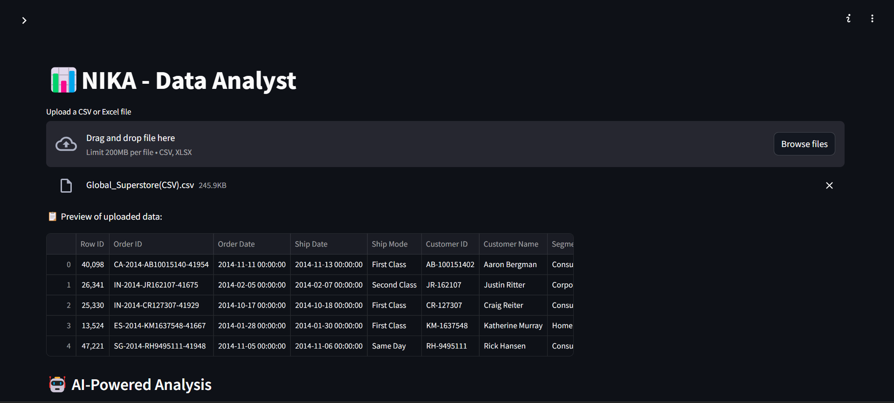

# NIKA - AI-Powered Data Analysis Agent 🤖



NIKA is your intelligent data analysis companion that combines the power of DuckDB, OpenAI's GPT models, and interactive visualizations to make data analysis accessible to everyone.

## 🎥 Demo


*Demo video coming soon...*

## ✨ Features

- **Natural Language Queries**: Simply ask questions about your data in plain English
- **Smart SQL Generation**: Automatically converts your questions into optimized SQL queries
- **Interactive Visualizations**: Beautiful charts and graphs powered by Plotly
- **Data Preprocessing**: Automatic handling of dates, missing values, and data type conversion
- **Query History**: Keep track of your analysis journey
- **Flexible Data Input**: Support for CSV and Excel files
- **Real-time Data Summary**: Instant overview of your dataset's characteristics

## 🚀 Getting Started

### Prerequisites

Make sure you have Python 3.8+ installed on your system. You'll also need an OpenAI API key.

### Installation

1. Clone this repository:
```bash
git clone https://github.com/vishnuvskvkl/nika.git
cd data_analysis_agent
```

2. Create a virtual environment (recommended):
```bash
python -m venv venv
source venv/bin/activate  # On Windows, use: venv\Scripts\activate
```

3. Install the required packages:
```bash
pip install -r requirements.txt
```

### Running NIKA

1. Start the application:
```bash
streamlit run data_analyst.py
```

2. Open your browser and go to `http://localhost:8501`

3. Enter your OpenAI API key in the sidebar

4. Upload your dataset and start analyzing!

## 📊 Example Queries

Here are some questions you can ask NIKA:

- "What are the top 5 selling products?"
- "Show me the average revenue by month"
- "Calculate the year-over-year growth rate"
- "Which customers have made the most purchases?"
- "What's the distribution of sales by region?"

## 🛠️ Technical Stack

- **Frontend**: Streamlit
- **Data Processing**: Pandas, DuckDB
- **Visualization**: Plotly Express
- **AI/ML**: OpenAI GPT-4/3.5
- **Query Engine**: DuckDB
- **Data Validation**: Custom preprocessing pipeline

## 📁 Project Structure

```
nika-data-analyst/
├── data_analyst.py        
├── requirements.txt      
├── .gitignore            
├── README.md             

```


## 📝 Requirements

Create a `requirements.txt` file with these dependencies:

```txt
streamlit>=1.24.0
pandas>=1.5.3
plotly>=5.13.0
phi-agent>=0.1.0
duckdb>=0.8.1
openpyxl>=3.1.2
```

## 🔒 Environment Variables

Create a `.env` file in the project root:

```env
OPENAI_API_KEY=your_api_key_here
```

## 🚨 Common Issues

1. **OpenAI API Key Error**
   - Make sure you've entered your API key correctly in the sidebar
   - Check if your API key has sufficient credits

2. **File Upload Issues**
   - Ensure your CSV/Excel file is properly formatted
   - Check if the file size is under the 200MB limit

3. **Visualization Errors**
   - Verify that your data contains numeric columns for plotting
   - Try refreshing the page if charts don't render


## 🚀 Future Roadmap

- [ ] Add support for more file formats (JSON, Parquet)
- [ ] Implement collaborative features
- [ ] Add custom visualization templates
- [ ] Support for real-time data streaming
- [ ] Integration with cloud storage providers

---

